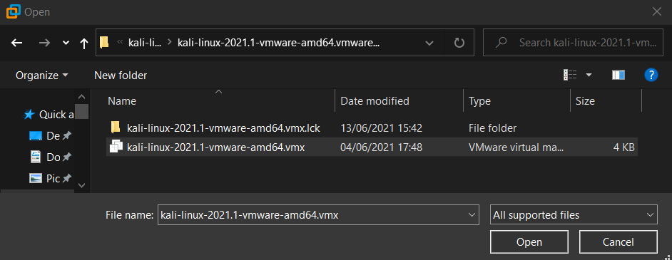
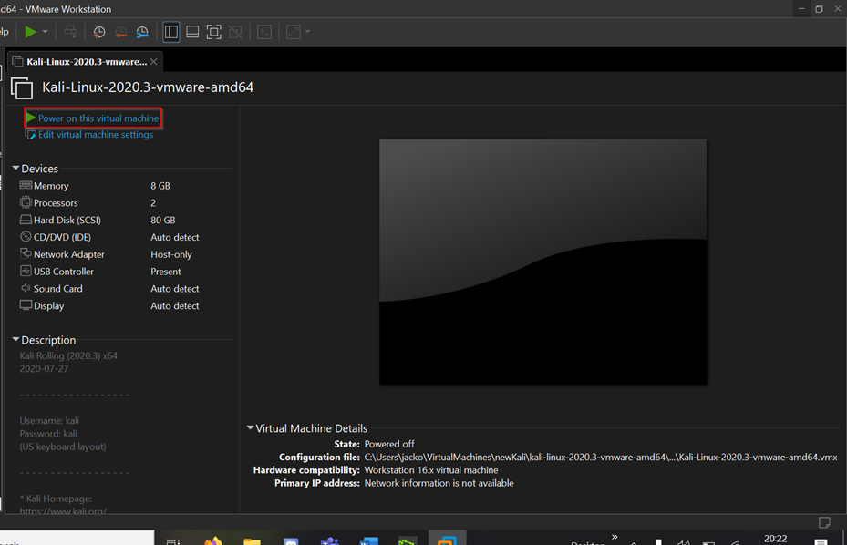
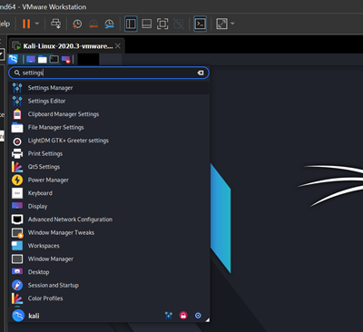
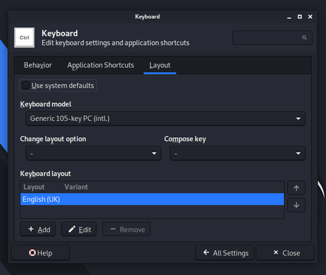

In this short guide I will show you how to install Kali Linux, using VMware Workstation Pro (which is provided free to Coventry University students) on Windows 10.

## Downloading VMware
As mentioned above, if you are a Coventry University Student, you are able to install VMware Pro for free. To grab your product key, you must head to [this site](https://coventry.onthehub.com/WebStore/Welcome.aspx) and login using your university credentials. Once signed in go to Students -> Development Tools -> VMware and choose the latest version of VMware Workstation pro and follow the standard instructions.

Once you download the install file, run the wizzard and follow all the default set-ups except we reccomend that you tick the box for install 'enhanced keyboard'. Please note you will have to reboot after installation!

If you are not a University student, then you are able to install VMware Player, which is free for non-comercial use (it just has less features). This can be [obtained here](https://www.vmware.com/uk/products/workstation-player.html).

## Download Kali
Now you must download a Kali Linux VM. This can be grabbed from the [offical Kali Linux Site](https://www.kali.org/get-kali/#kali-virtual-machines), you must download the file for 64-bit VMware.

Once downloaded, you must use 7-zip to extract the compressed files (please extract this to a rememberable location).

## Importing Kali
Next you have to add Kali Linux to VMware. To this open up VMware, and click 'open a VM'

Now navigate to the place where you extracted the Kali and then click on the vmx file, then open. If you are asked about how you obtained the image, click on 'I copied it'.

Now click on 'power on VM', and Kali Linux should begin to boot.

You should finally face a login screen - the credentials will be 'kali' and the password is 'kali'.

## Changing Keyboard Layout
By default this version of Kali uses the English US keyboard (where keys are mapped differently compared to the UK), therefore I reccomend that you change it to the UK (or your prefered layout).

To do this, open the Kali main menu by clicking on the dragon in the top left corner and clicking on the settings button.

Now go to Keyboard and change the layout to suit you.

